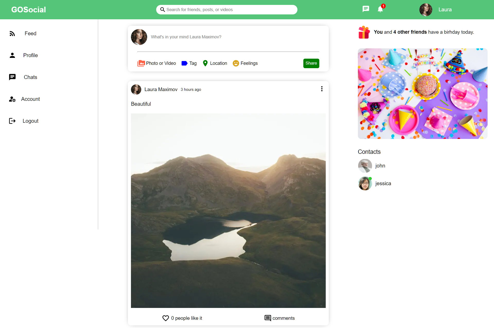
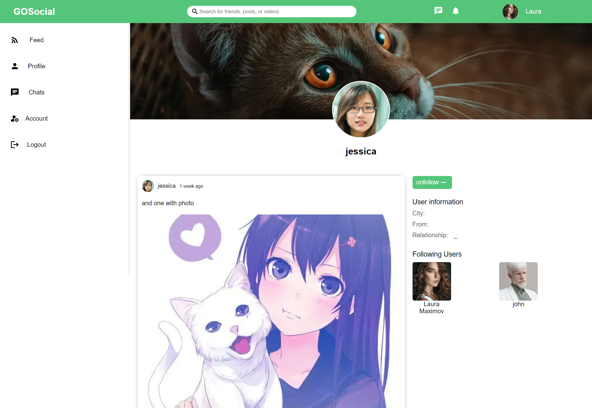
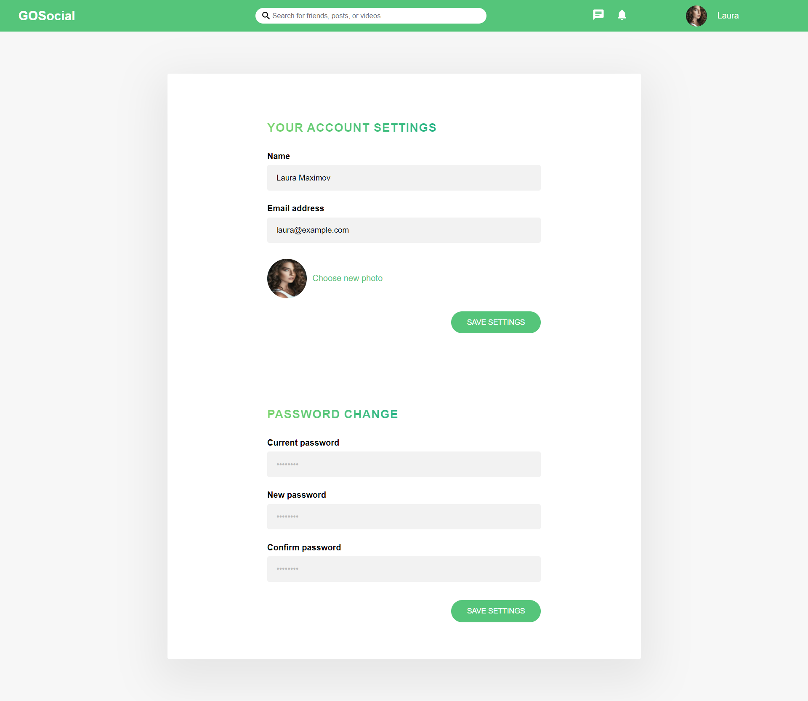
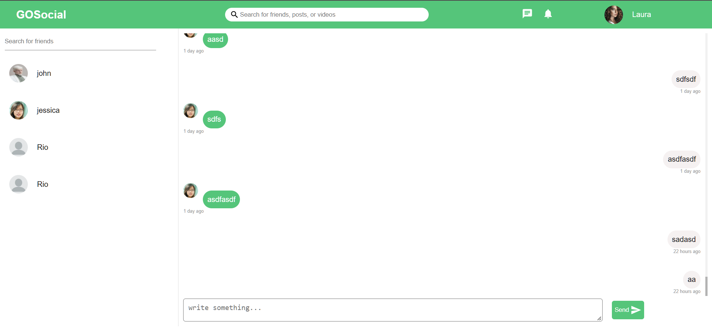
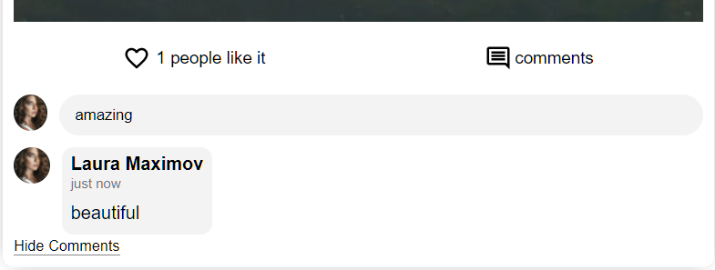
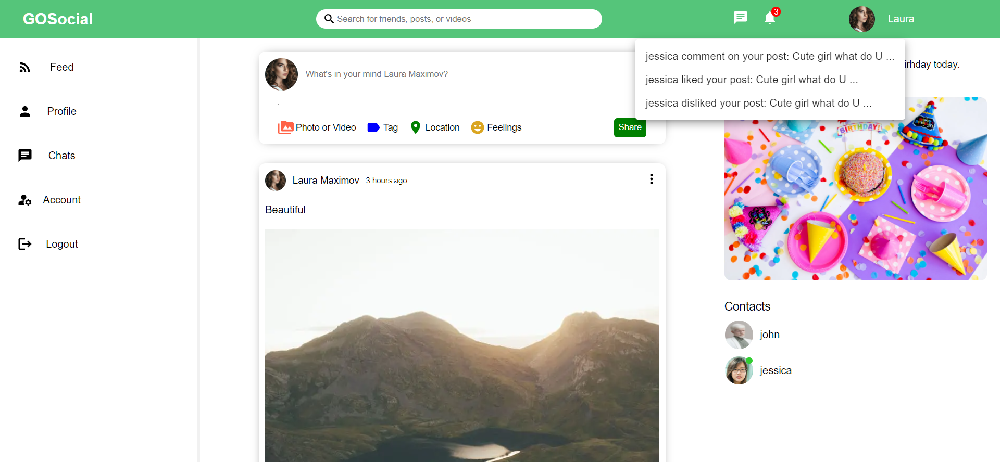

<h1 align="center">
  <br>
  <!-- 
  <a href="https://lakshman-natours.herokuapp.com/"></a>
  <br> -->
  GoSocial
  <br>
</h1>

<h4 align="center">An awesome Social Media web application built on top of <a href="https://nodejs.org/en/" target="_blank">NodeJS</a>.</h4>

 <p align="center">
 <a href="#deployed-version">Demo</a> •
  <a href="#key-features">Key Features</a> •
  <a href="#demonstration">Demonstration</a> •
  <a href="#how-to-use">How To Use</a> •
  <a href="#api-usage">API Usage</a> •
  <a href="#build-with">Build With</a> •
  <a href="#to-do">To-do</a> •
  <a href="#installation">Installation</a> • 
  <a href="#future-updates">Future Updates</a> • 
</p>

## Deployed Version

Live demo 👉 : https://ahmed-gosocial.herokuapp.com/

## Key Features

- Authentication and Authorization
  - Login, Signup and logout
- Posts
  - A User can see his/her posts and the posts of other users they followed
  - Share posts
  - comment on your or other users posts
  - like or dislike a post
  - Edit your own posts
  - Delete your own posts
- Realtime chat application
  - chat app with socket io server you can message your friends (users you are following)
- Instant Notification
  - you will be notified when other users like, dislike, or comment on your posts
  - you will notified when users message you on chat app
- Account setting page
  - Update name, photo, email, and password
- User profile
  - A user can see his/her profile page or other users profile
  - on profile page you can see user informations and the posts they share
  - follow or unfollow other users

## Demonstration

#### Home Page :



#### Your Profile :


#### users Profile :



#### Account Settings :



#### Chat :



#### Comment :



#### Notifications :



## How To Use

### Manage your Posts

- Share posts Edit them or delete them
- Like comment on posts that you like

### Chat With users

- Login to the site
- Search for users that you want to chat with
- follow them and start a conversation

### Update your profile

- You can update your own username, profile photo, email and password.

## API Usage

Before using the API, you need to set the variables in Postman depending on your environment (development or production). Simply add:

```
- Replace (localhost:8800) with your hostname as value (Eg. http://127.0.0.1:3000 or http://www.example.com)
```

Check [GoSocial API Documentation](https://documenter.getpostman.com/view/17588958/UyxohPEo) for more info.

<b> API Features: </b>

- Authentication and Authorization
- Create Posts
- Edit Posts
- Delete Posts
- Comment on Posts
- Like or dislike a Post
- Chat Messages and Conversation
- Edit user info
- Follow or unfollow users

## Build With

- [NodeJS](https://nodejs.org/en/) - JS runtime environment
- [Express](http://expressjs.com/) - The web framework used
- [Mongoose](https://mongoosejs.com/) - Object Data Modelling (ODM) library
- [MongoDB Atlas](https://www.mongodb.com/cloud/atlas) - Cloud database service
- [NextJs](https://nextjs.org/) - The React Framework for Production
- [socket io](https://socket.io/) - Bidirectional and low-latency communication
- [JSON Web Token](https://jwt.io/) - Security token
- [Postman](https://www.getpostman.com/) - API testing

## To-do

- ADD Forget Password Feature
- Allow user to Edit his info like city, relations and cover picture
- Advanced authentication features
  - confirm user email, login with google or other social media like github and facebook, two-factor authentication
- And More ! There's always room for improvement!

## Installation

You can fork the app or you can git-clone the app into your local machine. Once done that, please install all the
dependencies by running

```
run node app
$ cd Social-media-API
$ npm i
set your env variables
$ npm start

on another termenal
$ cd Social-media-FrontEnd
$ npm i
set your env variables
$ npm run dev (for development)
$ npm run build && npm start (for production)

to run socket server
$ cd Socket
$ npm i
$ npm start
```

## Future Updates

- Improve overall UX/UI and fix bugs
- And More ! There's always room for improvement!
